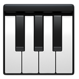
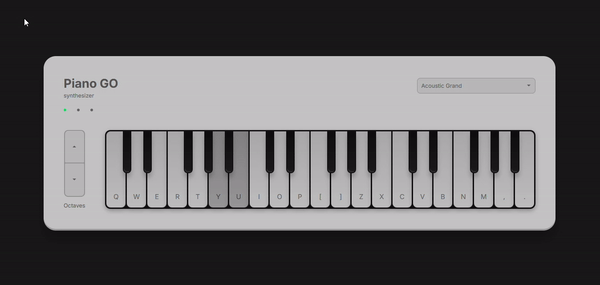

  
  <h1 align="center">Piano Keyboard Simulator</h1>
  

    Use your computer keyboard or click the keys with your mouse to play.
  

  

## Features

- Play with a computer keyboard or click the keys with a mouse
- Use sounds from three different instruments: Acoustic Grand, Electric Piano, and Music Box (more will be added in the future)
- Play notes in seven different octaves

## Built With

- **Client:** React, Redux Toolkit, SCSS, Tone, Vite, Vitest
- **API:** Node, Express, Octokit, Supertest

The audio files are hosted in another GitHub repo: <a href="https://github.com/ashleymays/piano-keyboard-audio">ashleymays/piano-keyboard-audio</a>.

## License

This software is covered under the <a href="./LICENSE.md">MIT license</a>.