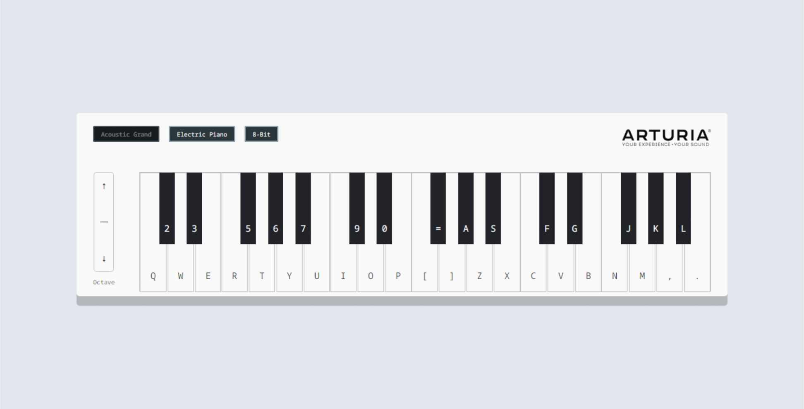

## How to Use

Clone the repository:

`git clone https://github.com/ashleymays/piano-keyboard-simulator.git`

Use the following command to start the server:

`npm start`

Use the following command to start the client:

`cd client && npm start`

The app will open in a browser window.

## License

This project uses the [MIT License](docs/LICENSE.md).
