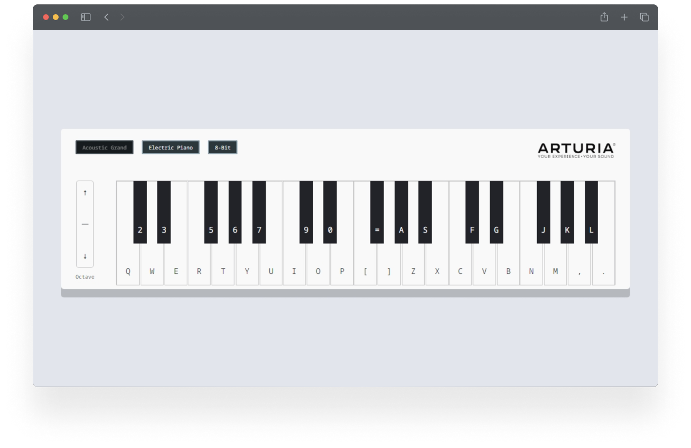

# Play piano right in your browser.

Use your computer keyboard, mouse, tablet, or phone to play a virtual keyboard. Choose from three different instrument sounds and play whatever you want.

## Background

I've been working on this since July 2022. I generally use this as a sandbox to learn new technologies. This was the first project I built with plain JavaScript, and then it was the first project I built with React.

Since I didn't know much about testing when I first started, there are no unit or integration tests available right now. I'll continue to work on that. This release will probably be the last, but please feel free to take the source code and do whatever you want with it (attribution would be nice, too :).

## How to Use

Clone the repository:

`git clone https://github.com/ashleymays/piano-keyboard-simulator.git`

Use the following command to run the build:

`npm i && npm start`

The app will open in a browser window.

## License

This project uses the [MIT License](docs/LICENSE.md).
