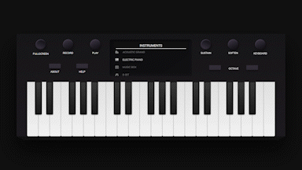

# Play piano in your browser.

This is an online piano that can be played with computer keyboard, mouse, or touch inputs. You can play one of four different instrument sounds and mimic the sustain and soften pedals on a grand piano. You can also record their playing and download their music as an .mp3 file.

Special thanks to Milan Maheshwari for their Skeumorphic Keyboard design on Figma.com, which this project took much of its inspiration from.

Note: As of 16 January 2023, this website only works for desktops and tablets.

## How to Use
Clone the repository:
`git clone https://github.com/ashleymays/online-piano.git`
Use the following command to start the server:
`npm start`
In a separate terminal, use the following command to start the client:
`cd client && npm start`.
The website will open in a browser window.

## License
This project uses the MIT License. [Read more](docs/LICENSE.md).
