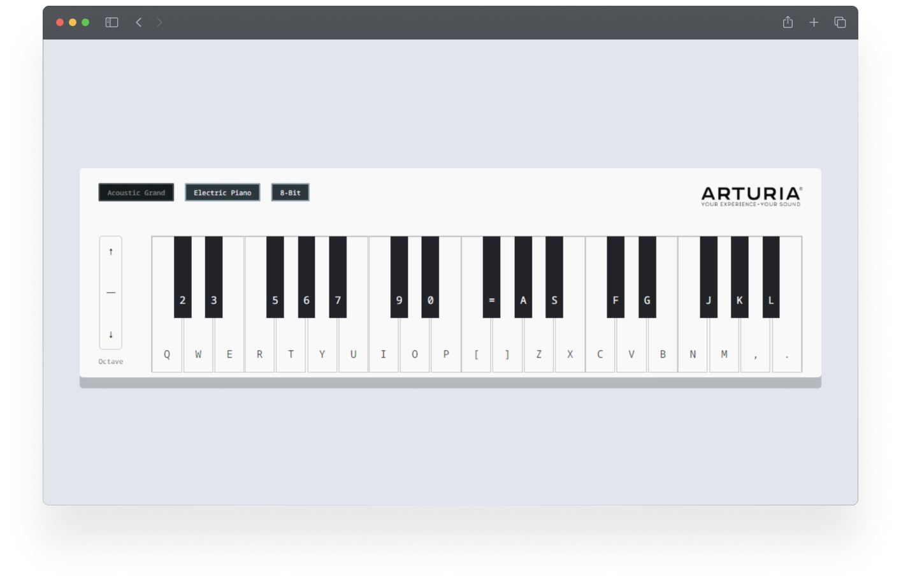

    

# Piano Keyboard Simulator

An online web app to play a virtual keyboard with key, mouse, and touch input.

## How to Use

### Option 1: Open online with Stackblitz

<a href="https://stackblitz.com/~/github.com/ashleymays/piano-keyboard-simulator">https://stackblitz.com/~/github.com/ashleymays/piano-keyboard-simulator</a>

### Option 2: Install it locally

Clone the repository:

`git clone https://github.com/ashleymays/piano-keyboard-simulator.git`

Run:

`npm i && npm start`

The app will open in a browser window.

## License

This project uses the [MIT License](LICENSE.md).
Feel free to take the source code and do whatever you want (attribution would be cool, too).
